# 沪牌拍卖价格分析
madlogos  
Friday, April 17, 2015  


# 分析说明 Intro

沪牌拍卖要拼人品。最低成交价往往出现在最后30秒内。但偶尔也有例外，最低成交价出现在较早的时段，这意味着有人为干预。这就为预估价格、提前伏击创造了机会。

数据来自网络，包括每月放牌数(`Plate`)、参拍人数(`Bidder`)、最低成交价(`MinPrice`)和平均价(`AvgPrice`)。

用`Rstudio 0.98.1103`的`rmarkdown`完成(`R 3.2RC`)。代码隐藏未显示。


# 基本情况 Basics

从2002年开始，中签率周期波动。2013年开始，急剧下滑。

## 中签率趋势 Plate vs Bid

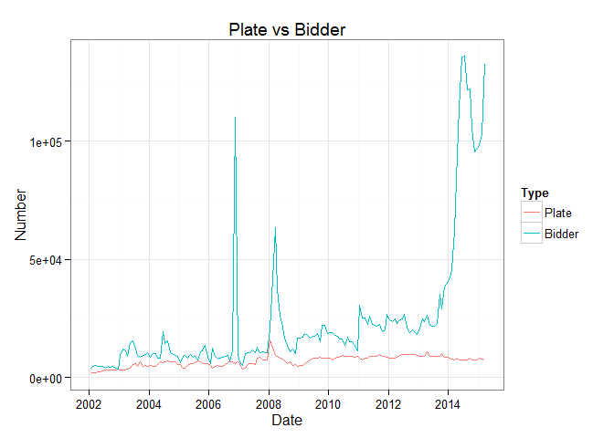 

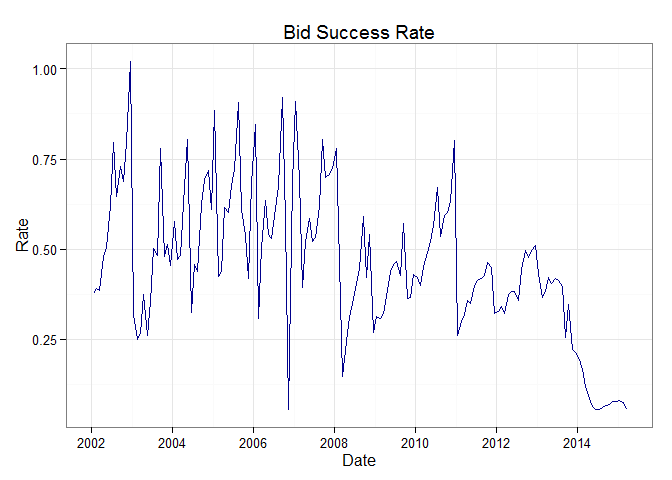 

## 均价趋势 Avg Price Trend
2002年至今合计，按月平均，均价波动不大。

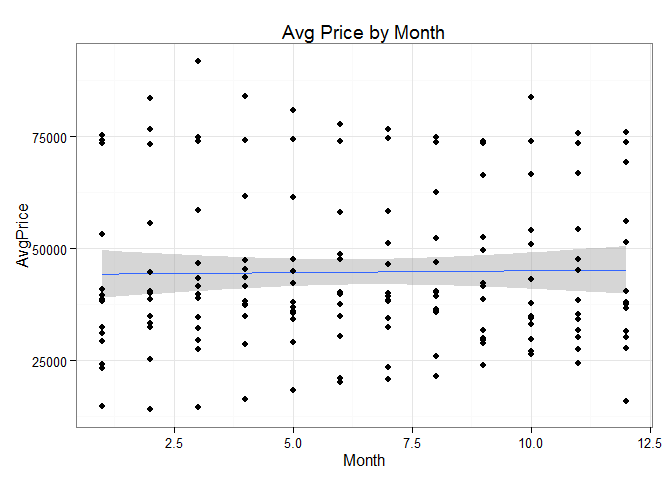 

但平均成交价一直在波动升高。每年的成交均价几乎是线性升高的。

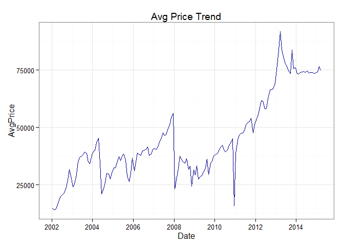 

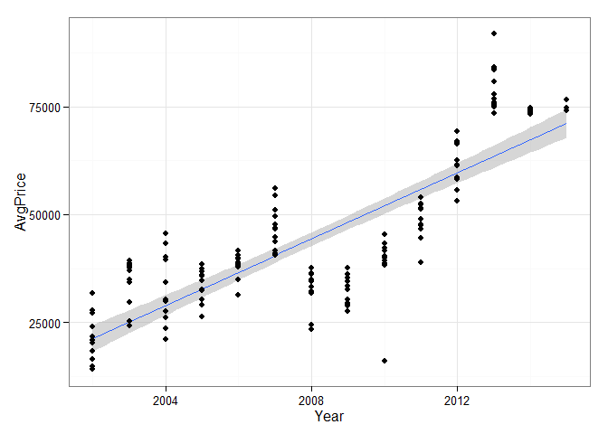 

历史上，6-7月是一个低谷，长假是高峰。这个趋势在2014年以后不见了。
而拍牌人数在春季升高，夏季到顶，秋季会回落。但中签率近几年始终很低。这些规律对拍牌命中帮助不大(-_-)。

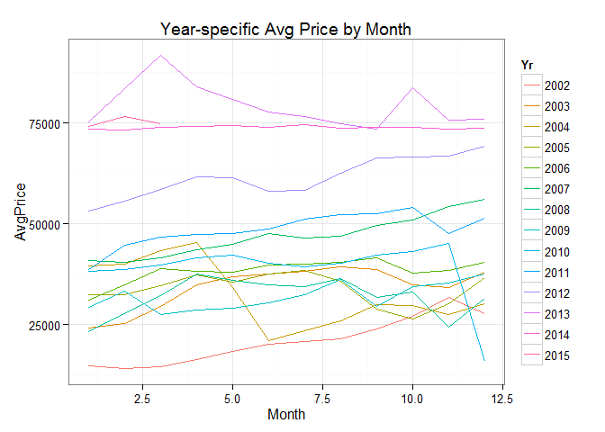 

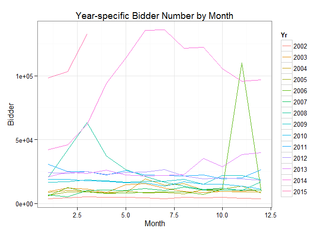 

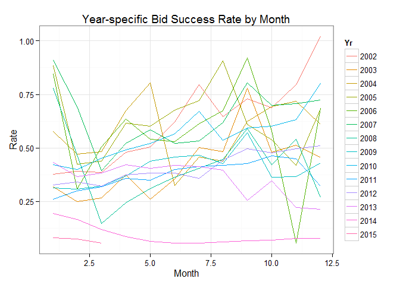 

# 线性拟合预测 Linear Model

懒得做时间序列，就直接暴力线性拟合了。用2011年以后的数据。

## 拟合4个模型 Fit 4 Models
为什么拟合4个？因为也就这么多变量了。。。

<table>
<caption>Adj $R^{2}$ of Models</caption>
 <thead>
  <tr>
   <th style="text-align:left;"> Model </th>
   <th style="text-align:right;"> $R^{2} Adj$ </th>
  </tr>
 </thead>
<tbody>
  <tr>
   <td style="text-align:left;"> AvgPrice~PrevPrice </td>
   <td style="text-align:right;"> 0.8170 </td>
  </tr>
  <tr>
   <td style="text-align:left;"> AvgPrice~PrevPrice+PrevBidder+Plate </td>
   <td style="text-align:right;"> 0.8131 </td>
  </tr>
  <tr>
   <td style="text-align:left;"> AvgPrice~PrevPrice+PrevBidder+Plate+Bidder </td>
   <td style="text-align:right;"> 0.8090 </td>
  </tr>
  <tr>
   <td style="text-align:left;"> AvgPrice~PrevPrice+PrevBidder+Plate+Bidder+PrevMinPrice </td>
   <td style="text-align:right;"> 0.8116 </td>
  </tr>
</tbody>
</table>


<table>
<caption>Parameter Estimate of Model 1-4</caption>
 <thead>
  <tr>
   <th style="text-align:left;"> Variable </th>
   <th style="text-align:right;"> Model 1 </th>
   <th style="text-align:right;"> Model 2 </th>
   <th style="text-align:right;"> Model 3 </th>
   <th style="text-align:right;"> Model 4 </th>
  </tr>
 </thead>
<tbody>
  <tr>
   <td style="text-align:left;"> (Intercept) </td>
   <td style="text-align:right;"> 1.470494e+04 </td>
   <td style="text-align:right;"> 7175.3251272 </td>
   <td style="text-align:right;"> 7075.6278084 </td>
   <td style="text-align:right;"> 7417.0583037 </td>
  </tr>
  <tr>
   <td style="text-align:left;"> Bidder </td>
   <td style="text-align:right;"> NaN </td>
   <td style="text-align:right;"> NaN </td>
   <td style="text-align:right;"> 0.0029741 </td>
   <td style="text-align:right;"> -0.0345129 </td>
  </tr>
  <tr>
   <td style="text-align:left;"> Plate </td>
   <td style="text-align:right;"> NaN </td>
   <td style="text-align:right;"> 0.9644115 </td>
   <td style="text-align:right;"> 0.9768321 </td>
   <td style="text-align:right;"> 0.5601606 </td>
  </tr>
  <tr>
   <td style="text-align:left;"> PrevBidder </td>
   <td style="text-align:right;"> NaN </td>
   <td style="text-align:right;"> 0.0320525 </td>
   <td style="text-align:right;"> 0.0292701 </td>
   <td style="text-align:right;"> 0.0629747 </td>
  </tr>
  <tr>
   <td style="text-align:left;"> PrevMinPrice </td>
   <td style="text-align:right;"> NaN </td>
   <td style="text-align:right;"> NaN </td>
   <td style="text-align:right;"> NaN </td>
   <td style="text-align:right;"> -1.2137834 </td>
  </tr>
  <tr>
   <td style="text-align:left;"> PrevPrice </td>
   <td style="text-align:right;"> 7.924684e-01 </td>
   <td style="text-align:right;"> 0.7597233 </td>
   <td style="text-align:right;"> 0.7593850 </td>
   <td style="text-align:right;"> 2.0173086 </td>
  </tr>
</tbody>
</table>

4个模型的$R^{2}$ Adj差不多。单用前期均价已经能预报了。

## 模型残差 Residuals

<table>
<caption>Std Dev of Residuals, Model 1-4 (last 20 records)</caption>
 <thead>
  <tr>
   <th style="text-align:left;"> Model </th>
   <th style="text-align:right;"> sd.Residual </th>
  </tr>
 </thead>
<tbody>
  <tr>
   <td style="text-align:left;"> Model 1 </td>
   <td style="text-align:right;"> 2868.360 </td>
  </tr>
  <tr>
   <td style="text-align:left;"> Model 2 </td>
   <td style="text-align:right;"> 2687.104 </td>
  </tr>
  <tr>
   <td style="text-align:left;"> Model 3 </td>
   <td style="text-align:right;"> 2688.873 </td>
  </tr>
  <tr>
   <td style="text-align:left;"> Model 4 </td>
   <td style="text-align:right;"> 2989.987 </td>
  </tr>
</tbody>
</table>

而用最后20次拍牌结果验证，残差的方差也差不多。实践下来，还是模型4更接近一些。

## 尝试预测 Predict Attempt

本轮投标152298人，放牌8288张，中签率。估计实际均价：

+ 模型1：**75422.28**

+ 模型2：**76685.44**

+ 模型3：**76828.5**

+ 模型4：**79173.45**

而平均价和最低价之间的差越来越小，成交区间非常窄。

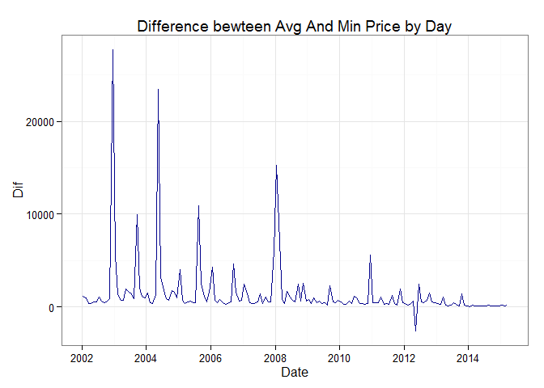 <table>
<caption>Summary of Differenece between Avg And Min Price by Year</caption>
 <thead>
  <tr>
   <th style="text-align:right;"> Year </th>
   <th style="text-align:right;"> Min </th>
   <th style="text-align:right;"> P25 </th>
   <th style="text-align:right;"> Median </th>
   <th style="text-align:right;"> Mean </th>
   <th style="text-align:right;"> P75 </th>
   <th style="text-align:right;"> Max </th>
  </tr>
 </thead>
<tbody>
  <tr>
   <td style="text-align:right;"> 2002 </td>
   <td style="text-align:right;"> 334 </td>
   <td style="text-align:right;"> 527.8 </td>
   <td style="text-align:right;"> 620.5 </td>
   <td style="text-align:right;"> 2948.00 </td>
   <td style="text-align:right;"> 993.8 </td>
   <td style="text-align:right;"> 27750 </td>
  </tr>
  <tr>
   <td style="text-align:right;"> 2003 </td>
   <td style="text-align:right;"> 745 </td>
   <td style="text-align:right;"> 932.8 </td>
   <td style="text-align:right;"> 1412.0 </td>
   <td style="text-align:right;"> 2353.00 </td>
   <td style="text-align:right;"> 1938.0 </td>
   <td style="text-align:right;"> 9928 </td>
  </tr>
  <tr>
   <td style="text-align:right;"> 2004 </td>
   <td style="text-align:right;"> 333 </td>
   <td style="text-align:right;"> 851.5 </td>
   <td style="text-align:right;"> 1404.0 </td>
   <td style="text-align:right;"> 3163.00 </td>
   <td style="text-align:right;"> 1750.0 </td>
   <td style="text-align:right;"> 23430 </td>
  </tr>
  <tr>
   <td style="text-align:right;"> 2005 </td>
   <td style="text-align:right;"> 384 </td>
   <td style="text-align:right;"> 509.8 </td>
   <td style="text-align:right;"> 693.0 </td>
   <td style="text-align:right;"> 1991.00 </td>
   <td style="text-align:right;"> 1768.0 </td>
   <td style="text-align:right;"> 10900 </td>
  </tr>
  <tr>
   <td style="text-align:right;"> 2006 </td>
   <td style="text-align:right;"> 252 </td>
   <td style="text-align:right;"> 437.2 </td>
   <td style="text-align:right;"> 673.5 </td>
   <td style="text-align:right;"> 1288.00 </td>
   <td style="text-align:right;"> 1019.0 </td>
   <td style="text-align:right;"> 4601 </td>
  </tr>
  <tr>
   <td style="text-align:right;"> 2007 </td>
   <td style="text-align:right;"> 323 </td>
   <td style="text-align:right;"> 454.0 </td>
   <td style="text-align:right;"> 514.0 </td>
   <td style="text-align:right;"> 1281.00 </td>
   <td style="text-align:right;"> 1375.0 </td>
   <td style="text-align:right;"> 6042 </td>
  </tr>
  <tr>
   <td style="text-align:right;"> 2008 </td>
   <td style="text-align:right;"> 359 </td>
   <td style="text-align:right;"> 644.5 </td>
   <td style="text-align:right;"> 869.0 </td>
   <td style="text-align:right;"> 2434.00 </td>
   <td style="text-align:right;"> 2068.0 </td>
   <td style="text-align:right;"> 15270 </td>
  </tr>
  <tr>
   <td style="text-align:right;"> 2009 </td>
   <td style="text-align:right;"> 231 </td>
   <td style="text-align:right;"> 411.2 </td>
   <td style="text-align:right;"> 463.0 </td>
   <td style="text-align:right;"> 674.80 </td>
   <td style="text-align:right;"> 719.5 </td>
   <td style="text-align:right;"> 2300 </td>
  </tr>
  <tr>
   <td style="text-align:right;"> 2010 </td>
   <td style="text-align:right;"> 271 </td>
   <td style="text-align:right;"> 351.5 </td>
   <td style="text-align:right;"> 385.5 </td>
   <td style="text-align:right;"> 936.20 </td>
   <td style="text-align:right;"> 718.2 </td>
   <td style="text-align:right;"> 5570 </td>
  </tr>
  <tr>
   <td style="text-align:right;"> 2011 </td>
   <td style="text-align:right;"> 208 </td>
   <td style="text-align:right;"> 341.2 </td>
   <td style="text-align:right;"> 432.0 </td>
   <td style="text-align:right;"> 632.60 </td>
   <td style="text-align:right;"> 628.0 </td>
   <td style="text-align:right;"> 1935 </td>
  </tr>
  <tr>
   <td style="text-align:right;"> 2012 </td>
   <td style="text-align:right;"> -2633 </td>
   <td style="text-align:right;"> 377.5 </td>
   <td style="text-align:right;"> 502.5 </td>
   <td style="text-align:right;"> 468.90 </td>
   <td style="text-align:right;"> 650.8 </td>
   <td style="text-align:right;"> 2427 </td>
  </tr>
  <tr>
   <td style="text-align:right;"> 2013 </td>
   <td style="text-align:right;"> 92 </td>
   <td style="text-align:right;"> 176.5 </td>
   <td style="text-align:right;"> 231.0 </td>
   <td style="text-align:right;"> 396.40 </td>
   <td style="text-align:right;"> 365.2 </td>
   <td style="text-align:right;"> 1423 </td>
  </tr>
  <tr>
   <td style="text-align:right;"> 2014 </td>
   <td style="text-align:right;"> 1 </td>
   <td style="text-align:right;"> 75.0 </td>
   <td style="text-align:right;"> 91.5 </td>
   <td style="text-align:right;"> 98.08 </td>
   <td style="text-align:right;"> 118.0 </td>
   <td style="text-align:right;"> 185 </td>
  </tr>
  <tr>
   <td style="text-align:right;"> 2015 </td>
   <td style="text-align:right;"> 118 </td>
   <td style="text-align:right;"> 167.0 </td>
   <td style="text-align:right;"> 216.0 </td>
   <td style="text-align:right;"> 188.00 </td>
   <td style="text-align:right;"> 223.0 </td>
   <td style="text-align:right;"> 230 </td>
  </tr>
</tbody>
</table>

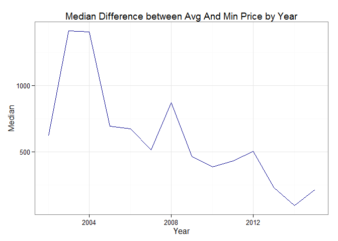 

所以基本就是估计均价上下浮动500块进行伏击。希望真的符合实际的情况（毛）。

# 时间序列分析 Time-series Analysis
> 4月18日拍牌失败。只好再接再厉。这里更新一下算命技术，看会不会准些。//摊手

## 差分 Differences

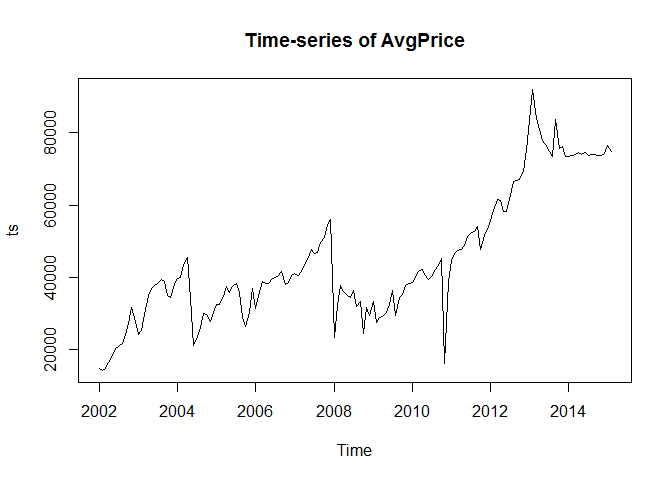 

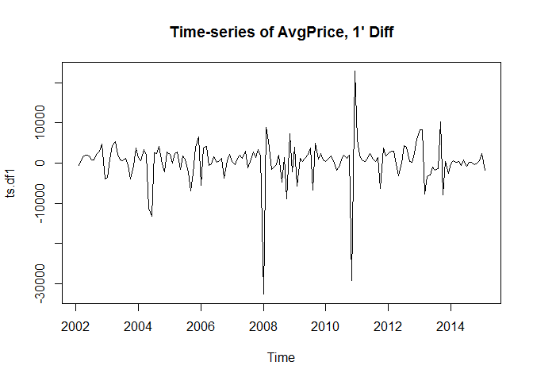 

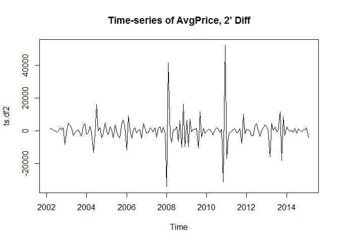 


二阶差分后看起来平稳一点，就它了。(实际上差分到10阶还是有奇异点，就随它去任性吧。)

## 确定模型参数 ARIMA parameters

### 自相关图ACF

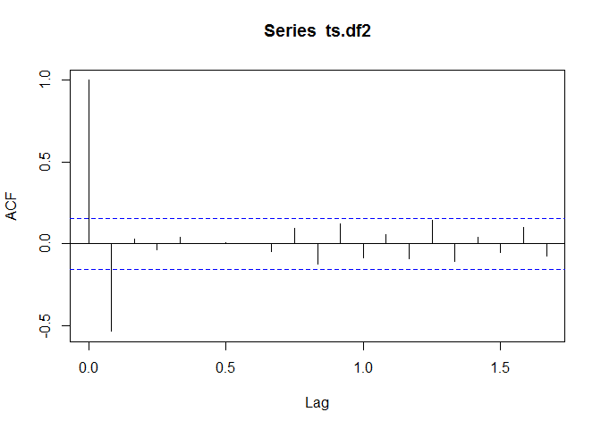 <table>
<caption>ACF</caption>
 <thead>
  <tr>
   <th style="text-align:right;"> i </th>
   <th style="text-align:right;"> Lag </th>
   <th style="text-align:right;"> ACF </th>
  </tr>
 </thead>
<tbody>
  <tr>
   <td style="text-align:right;"> 0 </td>
   <td style="text-align:right;"> 0.0000000 </td>
   <td style="text-align:right;"> 1.0000000 </td>
  </tr>
  <tr>
   <td style="text-align:right;"> 1 </td>
   <td style="text-align:right;"> 0.0833333 </td>
   <td style="text-align:right;"> -0.5364979 </td>
  </tr>
  <tr>
   <td style="text-align:right;"> 2 </td>
   <td style="text-align:right;"> 0.1666667 </td>
   <td style="text-align:right;"> 0.0295103 </td>
  </tr>
  <tr>
   <td style="text-align:right;"> 3 </td>
   <td style="text-align:right;"> 0.2500000 </td>
   <td style="text-align:right;"> -0.0368472 </td>
  </tr>
  <tr>
   <td style="text-align:right;"> 4 </td>
   <td style="text-align:right;"> 0.3333333 </td>
   <td style="text-align:right;"> 0.0423904 </td>
  </tr>
  <tr>
   <td style="text-align:right;"> 5 </td>
   <td style="text-align:right;"> 0.4166667 </td>
   <td style="text-align:right;"> 0.0025149 </td>
  </tr>
  <tr>
   <td style="text-align:right;"> 6 </td>
   <td style="text-align:right;"> 0.5000000 </td>
   <td style="text-align:right;"> 0.0082030 </td>
  </tr>
  <tr>
   <td style="text-align:right;"> 7 </td>
   <td style="text-align:right;"> 0.5833333 </td>
   <td style="text-align:right;"> -0.0003025 </td>
  </tr>
  <tr>
   <td style="text-align:right;"> 8 </td>
   <td style="text-align:right;"> 0.6666667 </td>
   <td style="text-align:right;"> -0.0454090 </td>
  </tr>
  <tr>
   <td style="text-align:right;"> 9 </td>
   <td style="text-align:right;"> 0.7500000 </td>
   <td style="text-align:right;"> 0.0953208 </td>
  </tr>
  <tr>
   <td style="text-align:right;"> 10 </td>
   <td style="text-align:right;"> 0.8333333 </td>
   <td style="text-align:right;"> -0.1232463 </td>
  </tr>
  <tr>
   <td style="text-align:right;"> 11 </td>
   <td style="text-align:right;"> 0.9166667 </td>
   <td style="text-align:right;"> 0.1202756 </td>
  </tr>
  <tr>
   <td style="text-align:right;"> 12 </td>
   <td style="text-align:right;"> 1.0000000 </td>
   <td style="text-align:right;"> -0.0859678 </td>
  </tr>
  <tr>
   <td style="text-align:right;"> 13 </td>
   <td style="text-align:right;"> 1.0833333 </td>
   <td style="text-align:right;"> 0.0550577 </td>
  </tr>
  <tr>
   <td style="text-align:right;"> 14 </td>
   <td style="text-align:right;"> 1.1666667 </td>
   <td style="text-align:right;"> -0.0895252 </td>
  </tr>
  <tr>
   <td style="text-align:right;"> 15 </td>
   <td style="text-align:right;"> 1.2500000 </td>
   <td style="text-align:right;"> 0.1425013 </td>
  </tr>
  <tr>
   <td style="text-align:right;"> 16 </td>
   <td style="text-align:right;"> 1.3333333 </td>
   <td style="text-align:right;"> -0.1079814 </td>
  </tr>
  <tr>
   <td style="text-align:right;"> 17 </td>
   <td style="text-align:right;"> 1.4166667 </td>
   <td style="text-align:right;"> 0.0392051 </td>
  </tr>
  <tr>
   <td style="text-align:right;"> 18 </td>
   <td style="text-align:right;"> 1.5000000 </td>
   <td style="text-align:right;"> -0.0531547 </td>
  </tr>
  <tr>
   <td style="text-align:right;"> 19 </td>
   <td style="text-align:right;"> 1.5833333 </td>
   <td style="text-align:right;"> 0.0996016 </td>
  </tr>
  <tr>
   <td style="text-align:right;"> 20 </td>
   <td style="text-align:right;"> 1.6666667 </td>
   <td style="text-align:right;"> -0.0772887 </td>
  </tr>
</tbody>
</table>

滞后2阶后自相关值即不超过边界值。故自相关选2阶。

### 偏相关图PACF

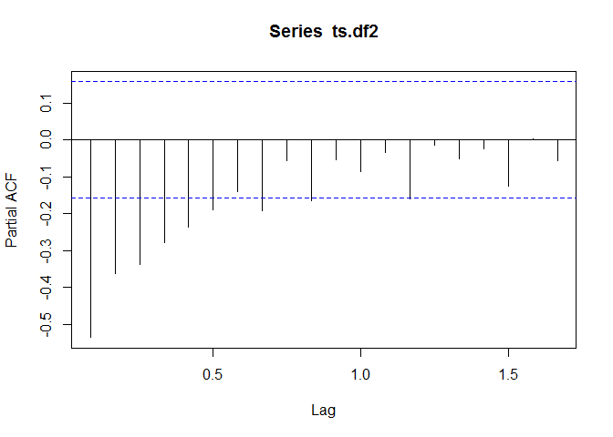 

<table>
<caption>PACF</caption>
 <thead>
  <tr>
   <th style="text-align:right;"> i </th>
   <th style="text-align:right;"> Lag </th>
   <th style="text-align:right;"> PACF </th>
  </tr>
 </thead>
<tbody>
  <tr>
   <td style="text-align:right;"> 1 </td>
   <td style="text-align:right;"> 0.0833333 </td>
   <td style="text-align:right;"> -0.5364979 </td>
  </tr>
  <tr>
   <td style="text-align:right;"> 2 </td>
   <td style="text-align:right;"> 0.1666667 </td>
   <td style="text-align:right;"> -0.3627220 </td>
  </tr>
  <tr>
   <td style="text-align:right;"> 3 </td>
   <td style="text-align:right;"> 0.2500000 </td>
   <td style="text-align:right;"> -0.3393394 </td>
  </tr>
  <tr>
   <td style="text-align:right;"> 4 </td>
   <td style="text-align:right;"> 0.3333333 </td>
   <td style="text-align:right;"> -0.2797851 </td>
  </tr>
  <tr>
   <td style="text-align:right;"> 5 </td>
   <td style="text-align:right;"> 0.4166667 </td>
   <td style="text-align:right;"> -0.2361004 </td>
  </tr>
  <tr>
   <td style="text-align:right;"> 6 </td>
   <td style="text-align:right;"> 0.5000000 </td>
   <td style="text-align:right;"> -0.1894344 </td>
  </tr>
  <tr>
   <td style="text-align:right;"> 7 </td>
   <td style="text-align:right;"> 0.5833333 </td>
   <td style="text-align:right;"> -0.1405862 </td>
  </tr>
  <tr>
   <td style="text-align:right;"> 8 </td>
   <td style="text-align:right;"> 0.6666667 </td>
   <td style="text-align:right;"> -0.1926987 </td>
  </tr>
  <tr>
   <td style="text-align:right;"> 9 </td>
   <td style="text-align:right;"> 0.7500000 </td>
   <td style="text-align:right;"> -0.0572385 </td>
  </tr>
  <tr>
   <td style="text-align:right;"> 10 </td>
   <td style="text-align:right;"> 0.8333333 </td>
   <td style="text-align:right;"> -0.1651563 </td>
  </tr>
  <tr>
   <td style="text-align:right;"> 11 </td>
   <td style="text-align:right;"> 0.9166667 </td>
   <td style="text-align:right;"> -0.0545309 </td>
  </tr>
  <tr>
   <td style="text-align:right;"> 12 </td>
   <td style="text-align:right;"> 1.0000000 </td>
   <td style="text-align:right;"> -0.0857903 </td>
  </tr>
  <tr>
   <td style="text-align:right;"> 13 </td>
   <td style="text-align:right;"> 1.0833333 </td>
   <td style="text-align:right;"> -0.0355571 </td>
  </tr>
  <tr>
   <td style="text-align:right;"> 14 </td>
   <td style="text-align:right;"> 1.1666667 </td>
   <td style="text-align:right;"> -0.1606541 </td>
  </tr>
  <tr>
   <td style="text-align:right;"> 15 </td>
   <td style="text-align:right;"> 1.2500000 </td>
   <td style="text-align:right;"> -0.0144222 </td>
  </tr>
  <tr>
   <td style="text-align:right;"> 16 </td>
   <td style="text-align:right;"> 1.3333333 </td>
   <td style="text-align:right;"> -0.0526999 </td>
  </tr>
  <tr>
   <td style="text-align:right;"> 17 </td>
   <td style="text-align:right;"> 1.4166667 </td>
   <td style="text-align:right;"> -0.0253542 </td>
  </tr>
  <tr>
   <td style="text-align:right;"> 18 </td>
   <td style="text-align:right;"> 1.5000000 </td>
   <td style="text-align:right;"> -0.1251225 </td>
  </tr>
  <tr>
   <td style="text-align:right;"> 19 </td>
   <td style="text-align:right;"> 1.5833333 </td>
   <td style="text-align:right;"> 0.0037262 </td>
  </tr>
  <tr>
   <td style="text-align:right;"> 20 </td>
   <td style="text-align:right;"> 1.6666667 </td>
   <td style="text-align:right;"> -0.0566721 </td>
  </tr>
</tbody>
</table>

滞后7阶后偏相关值大体不再超出边界值。（就算超过也就当它随机误差了。）故偏相关选7阶。于是ARIMA(p,d,q)参数是**arima(2,2,7)**

## ARIMA模型拟合 Fit ARIMA


```
## 
## Call:
## arima(x = ts, order = c(2, 2, 7))
## 
## Coefficients:
##           ar1      ar2      ma1     ma2      ma3     ma4     ma5     ma6
##       -0.7921  -0.9349  -0.4468  0.0893  -1.0965  0.2767  0.1514  0.1109
## s.e.   0.0523   0.0434   0.0988  0.1006   0.1027  0.1212  0.0945  0.1013
##           ma7
##       -0.0850
## s.e.   0.0887
## 
## sigma^2 estimated as 23712656:  log likelihood = -1550.72,  aic = 3121.44
```

### 预测 ARIMA Prediction

<table>
<caption>Predict AvgPrice using ARIMA(2,2,7)</caption>
 <thead>
  <tr>
   <th style="text-align:right;"> Month </th>
   <th style="text-align:right;"> Predicted Mean </th>
   <th style="text-align:right;"> Predicted Std. Error </th>
  </tr>
 </thead>
<tbody>
  <tr>
   <td style="text-align:right;"> 3 </td>
   <td style="text-align:right;"> 76225.93 </td>
   <td style="text-align:right;"> 4910.561 </td>
  </tr>
  <tr>
   <td style="text-align:right;"> 4 </td>
   <td style="text-align:right;"> 74907.90 </td>
   <td style="text-align:right;"> 6178.273 </td>
  </tr>
  <tr>
   <td style="text-align:right;"> 5 </td>
   <td style="text-align:right;"> 76137.00 </td>
   <td style="text-align:right;"> 6973.847 </td>
  </tr>
  <tr>
   <td style="text-align:right;"> 6 </td>
   <td style="text-align:right;"> 77767.21 </td>
   <td style="text-align:right;"> 7436.199 </td>
  </tr>
  <tr>
   <td style="text-align:right;"> 7 </td>
   <td style="text-align:right;"> 76713.81 </td>
   <td style="text-align:right;"> 7937.007 </td>
  </tr>
</tbody>
</table>


### 检验 Test

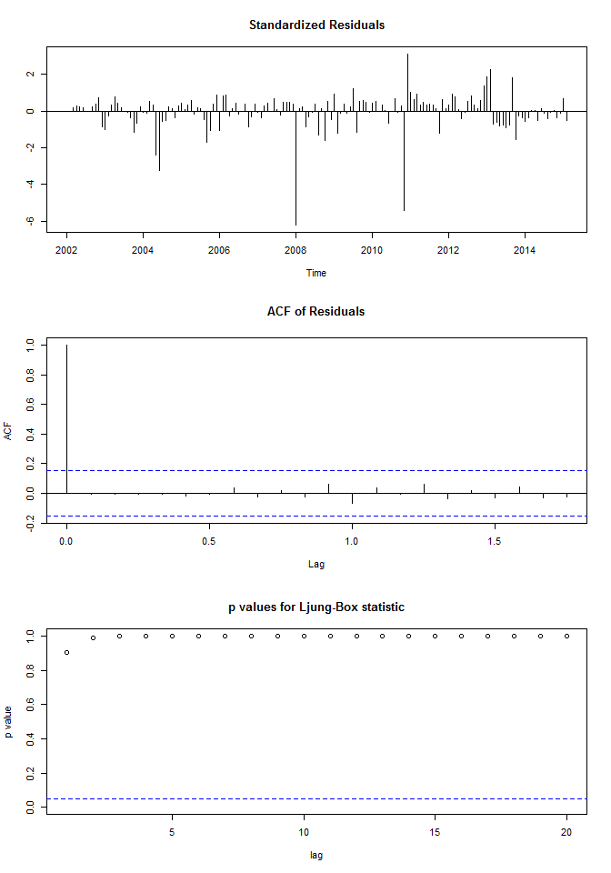 

自相关图显示滞后1-20阶，样本自相关值均不超过显著边界；Ljung-Box检验所有p值均大于0.05。在滞后1-20阶，都没有证据表明预测误差是非零自相关的。

# 结论 Summary
时间序列做下来，五月份价格是75000上下5000块。等于没说，最后成交区间根本就在上限那里。反正就是看命吧。
