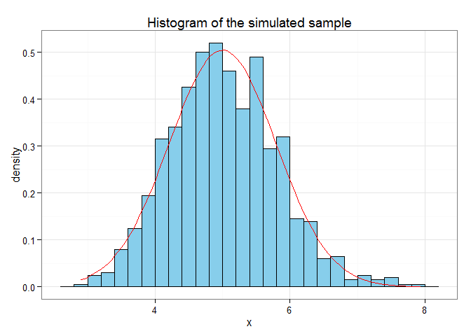

# Simulation to Test CLT of Exponential Distribution
Yiying Wang  
Saturday, April 25, 2015  

# Overview

In this project, I investigated the exponential distribution in R and compared it with the Central Limit Theorem (CLT).

The results below showed that the mean, variance and distribution are very close to the expected values based on CLT.

**Requirements as cited below**

> 1. Show the sample mean and compare it to the theoretical mean of the distribution.
> 2. Show how variable the sample is (via variance) and compare it to the theoretical variance of the distribution.
> 3. Show that the distribution is approximately normal.

> In point 3, focus on the difference between the distribution of a large collection of random exponentials and the distribution of a large collection of averages of 40 exponentials.

> The exponential distribution should be simulated in R with `rexp(n, lambda)` where lambda is the rate parameter. Set `lambda = 0.2` for all of the simulations to investigate the distribution of averages of `40` exponentials. `A thousand` simulations was required.

# Simulations

A data frame `sim.mean` containing 1000 simulated means was generated using `sapply` function. $\lambda$, n and number of simulations were set 0.2, 40 and 1000, respetively. 


```r
lambda <- 0.2
n <-40
nsim <- 1:1000
set.seed(20150425)
sim.mean <- data.frame(x = sapply(nsim, function(x) {
    mean(rexp(n, lambda))
    }))
head(sim.mean,n=5)
```

```
##          x
## 1 4.306688
## 2 5.808314
## 3 4.085993
## 4 5.484206
## 5 5.813944
```

```r
str(sim.mean)
```

```
## 'data.frame':	1000 obs. of  1 variable:
##  $ x: num  4.31 5.81 4.09 5.48 5.81 ...
```

# Sample Mean versus Theoretical Mean


```r
# mean of the simulated data sample
mean(sim.mean$x)
```

```
## [1] 5.020499
```

The theoretical mean of exponential distribution Exp(0.2) is $\frac{1}{\lambda}$, which values **5**. 

The mean of the simulated sample is **5.020499**. 

The sample mean is very close to the theorectical mean.

# Sample Variance versus Theoretical Variance


```r
# variance of the simulated data sample
var(sim.mean$x)
```

```
## [1] 0.6256601
```

The theoretical variance of exponential distribution Exp(0.2) is also $\frac{1}{\lambda}$, so the variance of 40 such exponentials is $\frac{\frac{1}{\lambda^2}}{n}$, which values **0.625**. 

The variance of the simulated sample is **0.6256601**. 

The sample variance is very close to the theorectical variance.

# Distribution

Let's make a histogram plot of the 1000 samples to see how the distribution looks like. Plot a normal distribution curve for comparison.


```r
library(ggplot2)
g <- ggplot(data=sim.mean,aes(x=x))+theme_bw()+
    geom_histogram(aes(y=..density..),fill="skyblue",
                   binwidth=0.2,color="black")+
    stat_function(fun=dnorm,color="red",arg=list(mean=5,sd=sd(sim.mean$x)))+
    ggtitle("Histogram of the simulated sample")
print(g)
```

 

The chart showed that the simulated sample distribution is approximately Gaussian N(5,0.7909868).
