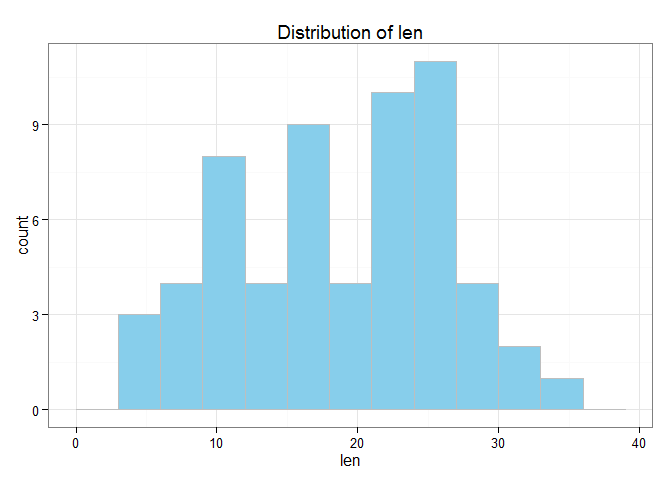
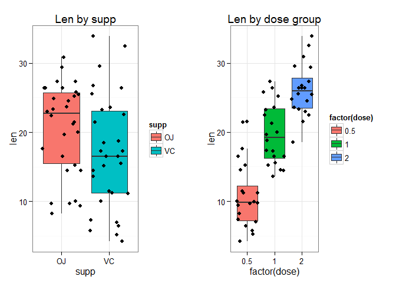
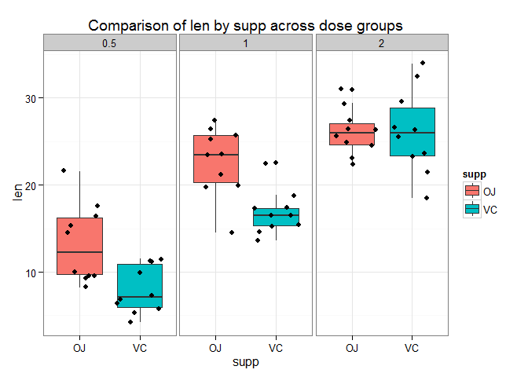

# Exploratory analysis and hypothesis test of ToothGrowth dataset
Yiying Wang  
Sunday, April 26, 2015  

# Overview

In this project, descriptive summary, confidence interval and hypothesis tests were given on the dataset `ToothGrowth`.

__Findings:__

1. Overall, the two `supp` OJ and VC has no difference in `len`
2. Overall, the larger the `dose`, the longer the `len`
3. At `dose` group 0.5 and 1, `supp` OJ has longer `len` than VC; at `dose` group 2, the two `supp` has no statistical difference

# Data Structure

The `ToothGrowth` dataset were loaded in the R `datasets` package. The dataset consists of 3 variables.


```r
library(datasets)
summary(ToothGrowth)
```

```
##       len        supp         dose      
##  Min.   : 4.20   OJ:30   Min.   :0.500  
##  1st Qu.:13.07   VC:30   1st Qu.:0.500  
##  Median :19.25           Median :1.000  
##  Mean   :18.81           Mean   :1.167  
##  3rd Qu.:25.27           3rd Qu.:2.000  
##  Max.   :33.90           Max.   :2.000
```

```r
with(ToothGrowth,table(supp,dose))
```

```
##     dose
## supp 0.5  1  2
##   OJ  10 10 10
##   VC  10 10 10
```

So the dataset has a numeric variable `len`, a factor variable `supp` with 2 levels `OJ` and `VC`, and another factor variable `dose` with 3 levels 0.5, 1 and 2.

# Descriptive analysis

## Overall distribution of tooth length

```r
library(ggplot2)
# Standard deviation of len
sd(ToothGrowth$len)
```

```
## [1] 7.649315
```

```r
g <- ggplot(ToothGrowth,aes(x=len))+theme_bw()+
    geom_histogram(fill="skyblue",binwidth=3,color="gray")+
    ggtitle("Distribution of len")
print(g)
```

 

The variable `len` does not appear normal.
Overall, the average teeth length is 18.8133333 $\pm$ 7.6493152.

## Tooth length distribution by supp, and by dose

```r
# len by supp,summary
tapply(ToothGrowth$len,ToothGrowth$supp,summary)
```

```
## $OJ
##    Min. 1st Qu.  Median    Mean 3rd Qu.    Max. 
##    8.20   15.52   22.70   20.66   25.72   30.90 
## 
## $VC
##    Min. 1st Qu.  Median    Mean 3rd Qu.    Max. 
##    4.20   11.20   16.50   16.96   23.10   33.90
```

```r
# len by supp, mean and sd (confidence interval)
data.frame(supp=c("VC","OJ"),
           mean=c(mean(ToothGrowth$len[ToothGrowth$supp=="VC"]),
                  mean(ToothGrowth$len[ToothGrowth$supp=="OJ"])),
           sd=c(sd(ToothGrowth$len[ToothGrowth$supp=="VC"]),
                  sd(ToothGrowth$len[ToothGrowth$supp=="OJ"])))
```

```
##   supp     mean       sd
## 1   VC 16.96333 8.266029
## 2   OJ 20.66333 6.605561
```

```r
# len by dose, summary
tapply(ToothGrowth$len,factor(ToothGrowth$dose),summary)
```

```
## $`0.5`
##    Min. 1st Qu.  Median    Mean 3rd Qu.    Max. 
##   4.200   7.225   9.850  10.600  12.250  21.500 
## 
## $`1`
##    Min. 1st Qu.  Median    Mean 3rd Qu.    Max. 
##   13.60   16.25   19.25   19.74   23.38   27.30 
## 
## $`2`
##    Min. 1st Qu.  Median    Mean 3rd Qu.    Max. 
##   18.50   23.52   25.95   26.10   27.83   33.90
```

```r
# len by supp, mean and sd (confidence interval)
data.frame(dose=c(0.5,1,2),
           mean=c(mean(ToothGrowth$len[ToothGrowth$dose==0.5]),
                  mean(ToothGrowth$len[ToothGrowth$dose==1]),
                  mean(ToothGrowth$len[ToothGrowth$dose==2])),
           sd=c(sd(ToothGrowth$len[ToothGrowth$dose==0.5]),
                sd(ToothGrowth$len[ToothGrowth$dose==1]),
                sd(ToothGrowth$len[ToothGrowth$dose==2])))
```

```
##   dose   mean       sd
## 1  0.5 10.605 4.499763
## 2  1.0 19.735 4.415436
## 3  2.0 26.100 3.774150
```

```r
# boxplots
g1 <- ggplot(data=ToothGrowth,aes(y=len,x=supp))+theme_bw()+
    geom_boxplot(aes(fill=supp))+geom_jitter()+ggtitle("Len by supp")
g2 <- ggplot(data=ToothGrowth,aes(y=len,x=factor(dose)))+theme_bw()+
    geom_boxplot(aes(fill=factor(dose)))+geom_jitter()+ggtitle("Len by dose group")
library(gridExtra)
```

```
## Loading required package: grid
```

```r
grid.arrange(g1,g2,ncol=2)
```

 

It seems that the supp group OJ has longer teeth than VC, and the len grows with dose.

## Tooth length distribution by supp and dose


```r
aggregate(len~dose+supp,ToothGrowth,summary)
```

```
##   dose supp len.Min. len.1st Qu. len.Median len.Mean len.3rd Qu. len.Max.
## 1  0.5   OJ     8.20        9.70      12.25    13.23       16.18    21.50
## 2  1.0   OJ    14.50       20.30      23.45    22.70       25.65    27.30
## 3  2.0   OJ    22.40       24.58      25.95    26.06       27.08    30.90
## 4  0.5   VC     4.20        5.95       7.15     7.98       10.90    11.50
## 5  1.0   VC    13.60       15.27      16.50    16.77       17.30    22.50
## 6  2.0   VC    18.50       23.38      25.95    26.14       28.80    33.90
```

```r
g <- ggplot(data=ToothGrowth,aes(y=len,x=supp))+theme_bw()+
    facet_grid(.~dose)+geom_boxplot(aes(fill=supp))+geom_jitter()+
    ggtitle("Comparison of len by supp across dose groups")
print(g)
```

 

In the low-dose groups, OJ group has longer teeth than VC group, while in high-dose group, the two supp seem to have similar teeth length.

# Compare tooth growth by supp and dose

## Compare tooth growth by supp

* H0: difference in means of group OJ and VC is equal to 0.
* Ha: difference in means of group OJ and VC is NOT equal to 0.

If p-value < 0.05, then we reject H0 and accpet Ha.


```r
t.test(len~supp,ToothGrowth)
```

```
## 
## 	Welch Two Sample t-test
## 
## data:  len by supp
## t = 1.9153, df = 55.309, p-value = 0.06063
## alternative hypothesis: true difference in means is not equal to 0
## 95 percent confidence interval:
##  -0.1710156  7.5710156
## sample estimates:
## mean in group OJ mean in group VC 
##         20.66333         16.96333
```

We cannot reject H0. The two groups should be deemed as no difference.

## Compare tooth growth by dose

Since dose has 3 levels, when we do comparisons between 2 out of the 3 levels repeatedly, the chance of Type 2 error increases. So we use `pairwise.t.test` with `Bonferroni` adjustion to reduce the chance.

* H0: Difference in means of dose group x and y is equal to 0
* Ha: Difference in means of dose group x and y is NOT equal to 0


```r
with(ToothGrowth,pairwise.t.test(len,factor(dose),p.adj="bonf"))
```

```
## 
## 	Pairwise comparisons using t tests with pooled SD 
## 
## data:  len and factor(dose) 
## 
##   0.5     1      
## 1 2.0e-08 -      
## 2 4.4e-16 4.3e-05
## 
## P value adjustment method: bonferroni
```

Since each of the p-value is less than 0.05, we reject H0 in each case. That's to say, dose group 2 has larger len than group 1, and group 1 has larger len than group 0.5.

## Compare tooth growth by supp and dose

Similarly, we use `pairwise.t.test` with `Bonferroni` adjustion to compare means of len with different supp, across all dose groups.

* H0: Difference in means of supp group x and y is equal to 0
* Ha: Difference in means of supp group x and y is NOT equal to 0


```r
ToothGrowth$grp <- paste(ToothGrowth$supp,ToothGrowth$dose)
with(ToothGrowth,pairwise.t.test(len,grp,p.adj="bonf"))
```

```
## 
## 	Pairwise comparisons using t tests with pooled SD 
## 
## data:  len and grp 
## 
##        OJ 0.5  OJ 1    OJ 2    VC 0.5  VC 1   
## OJ 1   4.8e-06 -       -       -       -      
## OJ 2   2.1e-09 0.6503  -       -       -      
## VC 0.5 0.0314  3.0e-11 2.0e-14 -       -      
## VC 1   0.5048  0.0088  7.2e-06 2.2e-05 -      
## VC 2   1.8e-09 0.5816  1.0000  1.7e-14 6.0e-06
## 
## P value adjustment method: bonferroni
```

1. At dose group 0.5, p-value of OJ vs VC = 0.0314 (< 0.05), so we reject H0. That's to say, OJ has larger len than VC.
2. At dose group 1, p-value of OJ vs VC = 0.0088 (< 0.05), so we reject H0. That's to say, OJ has larger len than VC.
3. At dose group 2, p-value of OJ vs VC = 1.0000 (> 0.05), so we cannot reject H0. That's to say, OJ has the same len as VC.

# Conclusions

According to the results above, we conclude that

1. there is no difference between OJ and VC group in effect of tooth growth
2. regardless supp type, the tooth growth effect gets better when supp dose increases
3. combinig the above two findings, in dose group 0.5 and 1, OJ has better tooth growth effect than VC; while in dose group 2, the two supp's has no difference in tooth growth effect.
